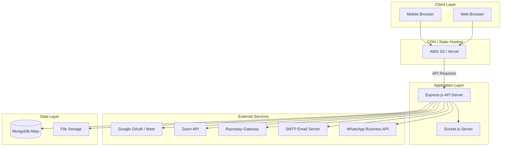
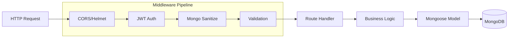
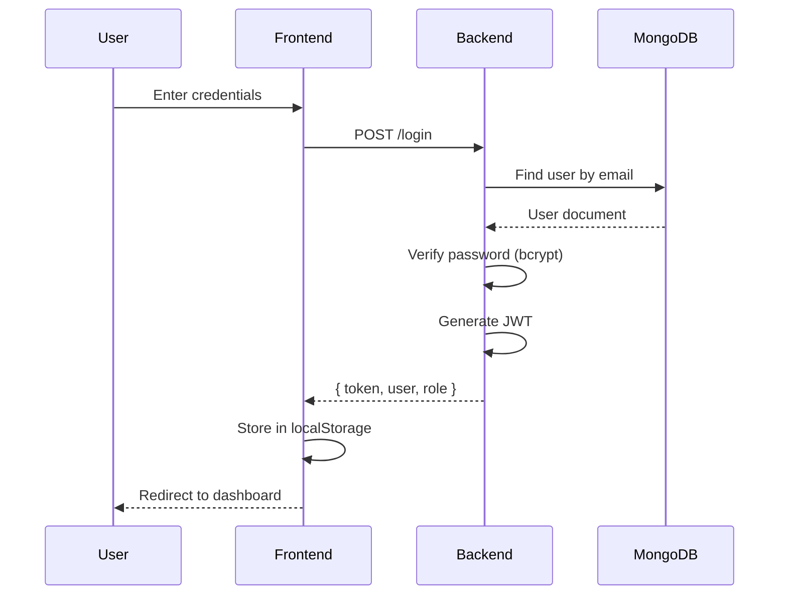
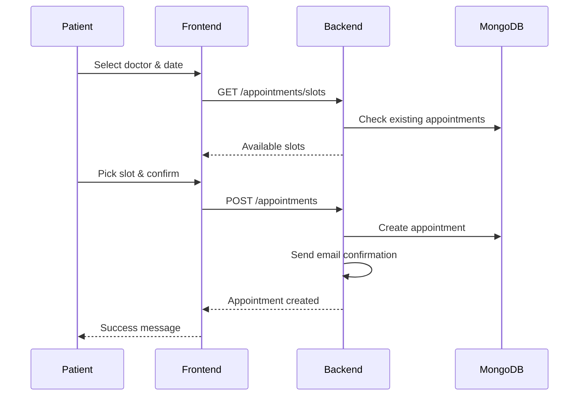
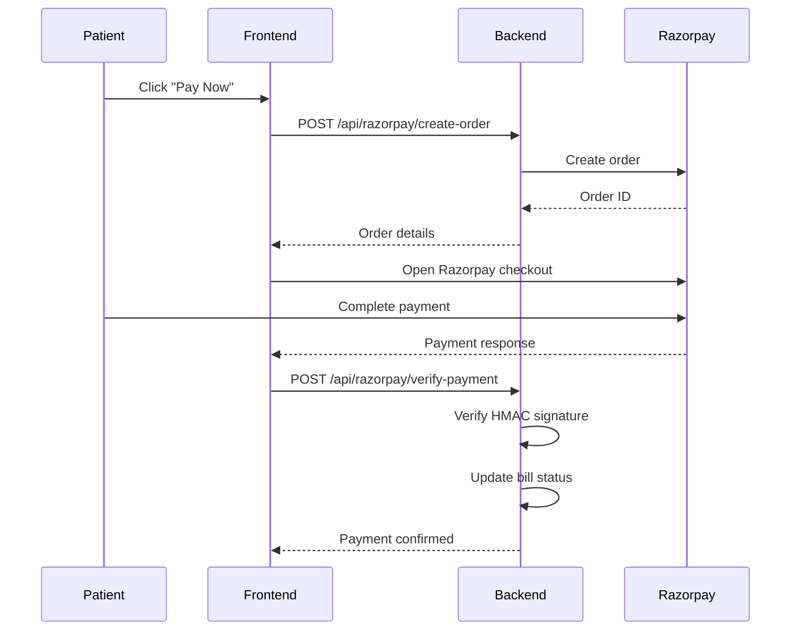

# System Architecture

## 🔭 High-Level Overview

OneCare is a comprehensive Hospital Management System (HMS) designed to manage multi-clinic operations. It follows a **Client-Server Architecture** with role-based dashboards.

---

## 🏗️ System Architecture Diagram



---

## 🧩 Component Breakdown

### 1. Frontend (React + Vite)

| Dashboard              | Role         | Key Features                       |
| ---------------------- | ------------ | ---------------------------------- |
| `/admin-dashboard`     | Super Admin  | System-wide control, all clinics   |
| `/clinic-dashboard`    | Clinic Admin | Single clinic management           |
| `/doctor-dashboard`    | Doctor       | Patients, appointments, encounters |
| `/patient-dashboard`   | Patient      | Booking, bills, medical reports    |
| `/reception-dashboard` | Receptionist | Front-desk operations              |

**Technology Stack:**

- React 18 with Vite
- React Router v6
- Bootstrap 5 + Custom CSS
- Axios for API calls
- React Hot Toast for notifications

### 2. Backend (Node.js + Express)



**Key Modules:**
| Module | Purpose |
|--------|---------|
| `auth.js` | JWT authentication & Google OAuth |
| `billingRoutes.js` | Invoicing & Razorpay payments |
| `appointmentRoutes.js` | Booking & scheduling |
| `pdfRoutes.js` | PDF generation with pdf-lib |
| `socketServer.js` | Real-time notifications |

### 3. Database (MongoDB Atlas)

- **Type**: Document-oriented NoSQL
- **Hosting**: MongoDB Atlas (managed cloud)
- **Collections**: 19 (see DATABASE_SCHEMA.md)
- **Indexes**: On `clinicId`, `date`, `email` for performance

---

## 🔄 Key Data Flows

### Authentication Flow



### Appointment Booking Flow



### Payment Flow (Razorpay)



---

## 🌐 Infrastructure (Production)

```
┌─────────────────────────────────────────────────────────────┐
│                        Internet                              │
└─────────────────────────────┬───────────────────────────────┘
                              │
        ┌─────────────────────┴─────────────────────┐
        │                                           │
        ▼                                           ▼
┌───────────────────┐                    ┌───────────────────┐
│   CloudFront      │                    │   EC2 Instance    │
│   (CDN + SSL)     │                    │   (Ubuntu 22.04)  │
│                   │                    │                   │
│   S3 Static Site  │                    │   Node.js + PM2   │
│   (React Build)   │                    │   Nginx (Proxy)   │
└───────────────────┘                    └─────────┬─────────┘
                                                   │
                                         ┌─────────┴─────────┐
                                         │  MongoDB Atlas    │
                                         │  (Managed Cloud)  │
                                         └───────────────────┘
```

---

## 🔐 Security Architecture

| Layer              | Protection                             |
| ------------------ | -------------------------------------- |
| **Transport**      | HTTPS (SSL/TLS) via Certbot/CloudFront |
| **API**            | Helmet.js (security headers)           |
| **Authentication** | JWT with 7-day expiry                  |
| **Authorization**  | Role-based middleware checks           |
| **Data**           | Bcrypt password hashing (10 rounds)    |
| **Injection**      | MongoDB sanitization middleware        |
| **CORS**           | Whitelist-based origin control         |

---

## 📊 Performance Considerations

- **Lazy Loading**: Frontend components loaded on-demand
- **Compression**: Gzip enabled via Express middleware
- **Database Indexes**: On frequently queried fields
- **Connection Pooling**: Mongoose default pooling
- **CDN Caching**: Static assets cached at edge locations
