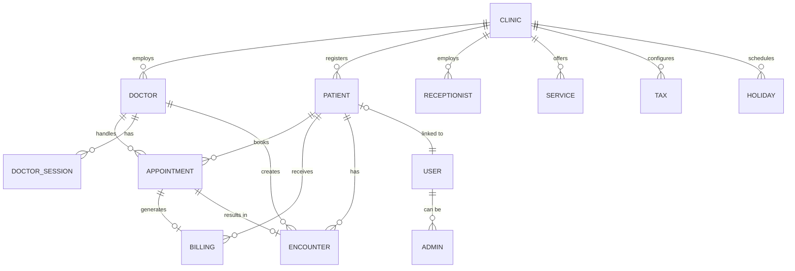

# Database Schema Documentation

The application uses **MongoDB** with **Mongoose** as the ODM. This document covers all 19 data models and their relationships.

---

## 📊 Entity Relationship Diagram

---

## 👥 Authentication Models

### `User`

Base user model for patients and clinic admins.

| Field                  | Type     | Description                |
| ---------------------- | -------- | -------------------------- |
| `email`                | String   | Unique email address       |
| `password`             | String   | Bcrypt hashed password     |
| `name`                 | String   | Full name                  |
| `role`                 | String   | `patient`, `clinic_admin`  |
| `clinicId`             | ObjectId | Reference to Clinic        |
| `googleId`             | String   | Google OAuth ID (optional) |
| `profileCompleted`     | Boolean  | Profile setup status       |
| `resetPasswordToken`   | String   | Password reset token       |
| `resetPasswordExpires` | Date     | Token expiry               |

### `Admin`

Super administrators with system-wide access.

| Field      | Type   | Description     |
| ---------- | ------ | --------------- |
| `email`    | String | Unique email    |
| `password` | String | Hashed password |
| `name`     | String | Admin name      |
| `role`     | String | Always `admin`  |

### `Doctor`

Medical professionals with clinic assignment.

| Field                   | Type     | Description            |
| ----------------------- | -------- | ---------------------- |
| `email`                 | String   | Unique email           |
| `password`              | String   | Hashed password        |
| `firstName`, `lastName` | String   | Name                   |
| `phone`                 | String   | Contact number         |
| `specialization`        | String   | Medical specialty      |
| `qualifications`        | String   | Degrees/certifications |
| `experience`            | Number   | Years of experience    |
| `consultationFee`       | Number   | Fee per consultation   |
| `clinicId`              | ObjectId | Reference to Clinic    |
| `mustChangePassword`    | Boolean  | Force password change  |
| `googleMeetToken`       | Object   | Google OAuth tokens    |
| `zoomToken`             | Object   | Zoom OAuth tokens      |

### `Receptionist`

Front desk staff with clinic assignment.

| Field                | Type     | Description           |
| -------------------- | -------- | --------------------- |
| `email`              | String   | Unique email          |
| `password`           | String   | Hashed password       |
| `name`               | String   | Full name             |
| `phone`              | String   | Contact               |
| `clinicId`           | ObjectId | Reference to Clinic   |
| `mustChangePassword` | Boolean  | Force password change |

---

## 🏥 Core Operational Models

### `Clinic`

Hospital/clinic entity.

| Field                      | Type   | Description                   |
| -------------------------- | ------ | ----------------------------- |
| `name`                     | String | Clinic name                   |
| `address`                  | String | Full address                  |
| `city`, `state`, `pincode` | String | Location details              |
| `phone`, `email`           | String | Contact info                  |
| `logo`                     | String | Logo URL path                 |
| `website`                  | String | Website URL                   |
| `gstin`                    | String | Tax ID (GST)                  |
| `billPrefix`               | String | Invoice prefix (e.g., "INV-") |

### `Patient`

Patient medical profiles.

| Field                   | Type     | Description               |
| ----------------------- | -------- | ------------------------- |
| `firstName`, `lastName` | String   | Name                      |
| `email`                 | String   | Contact email             |
| `phone`                 | String   | Phone number              |
| `dob`                   | Date     | Date of birth             |
| `gender`                | String   | `male`, `female`, `other` |
| `bloodGroup`            | String   | Blood type                |
| `address`               | String   | Home address              |
| `emergencyContact`      | String   | Emergency phone           |
| `clinicId`              | ObjectId | Reference to Clinic       |
| `userId`                | ObjectId | Link to User account      |

### `Appointment`

Scheduled appointments.

| Field             | Type     | Description                                     |
| ----------------- | -------- | ----------------------------------------------- |
| `appointmentId`   | String   | Auto-generated ID (APT-YYYY-XXXXX)              |
| `patientId`       | ObjectId | Reference to Patient                            |
| `patientName`     | String   | Denormalized name                               |
| `doctorId`        | ObjectId | Reference to Doctor                             |
| `doctorName`      | String   | Denormalized name                               |
| `clinicId`        | ObjectId | Reference to Clinic                             |
| `date`            | Date     | Appointment date                                |
| `time`            | String   | Time slot (e.g., "10:00 AM")                    |
| `slot`            | String   | Full slot range                                 |
| `type`            | String   | `in-person`, `video`                            |
| `status`          | String   | `scheduled`, `completed`, `cancelled`, `noshow` |
| `services`        | String   | Services provided                               |
| `charges`         | Number   | Consultation fee                                |
| `paymentMode`     | String   | `Cash`, `Online`                                |
| `meetingLink`     | String   | Video call URL                                  |
| `meetingProvider` | String   | `google_meet`, `zoom`                           |

### `DoctorSession`

Doctor availability configuration.

| Field          | Type     | Description                    |
| -------------- | -------- | ------------------------------ |
| `doctorId`     | ObjectId | Reference to Doctor            |
| `clinicId`     | ObjectId | Reference to Clinic            |
| `day`          | String   | Day of week (Monday, etc.)     |
| `startTime`    | String   | Start time (e.g., "09:00")     |
| `endTime`      | String   | End time (e.g., "17:00")       |
| `slotDuration` | Number   | Minutes per slot (default: 30) |
| `isActive`     | Boolean  | Session active status          |

### `Encounter`

Medical consultation records.

| Field            | Type     | Description                                  |
| ---------------- | -------- | -------------------------------------------- |
| `patientId`      | ObjectId | Reference to Patient                         |
| `doctorId`       | ObjectId | Reference to Doctor                          |
| `appointmentId`  | ObjectId | Reference to Appointment                     |
| `clinicId`       | ObjectId | Reference to Clinic                          |
| `date`           | Date     | Encounter date                               |
| `chiefComplaint` | String   | Main symptoms                                |
| `symptoms`       | String   | Detailed symptoms                            |
| `diagnosis`      | String   | Medical diagnosis                            |
| `prescription`   | Array    | Medications prescribed                       |
| `vitals`         | Object   | `{ bp, weight, height, temperature, pulse }` |
| `notes`          | String   | Additional notes                             |
| `reports`        | Array    | Attached medical reports                     |

### `EncounterTemplate`

Reusable encounter templates.

| Field      | Type     | Description         |
| ---------- | -------- | ------------------- |
| `name`     | String   | Template name       |
| `doctorId` | ObjectId | Reference to Doctor |
| `clinicId` | ObjectId | Reference to Clinic |
| `content`  | Object   | Template fields     |

---

## 💰 Billing Models

### `Billing`

Invoice/bill records.

| Field               | Type     | Description                      |
| ------------------- | -------- | -------------------------------- |
| `billNumber`        | String   | Auto-generated (INV-XXXXX)       |
| `patientId`         | ObjectId | Reference to Patient             |
| `patientName`       | String   | Denormalized name                |
| `doctorId`          | ObjectId | Reference to Doctor              |
| `appointmentId`     | ObjectId | Reference to Appointment         |
| `clinicId`          | ObjectId | Reference to Clinic              |
| `services`          | Array    | `[{ name, amount, quantity }]`   |
| `subTotal`          | Number   | Sum before tax/discount          |
| `discount`          | Number   | Discount amount                  |
| `taxDetails`        | Array    | `[{ name, percentage, amount }]` |
| `taxAmount`         | Number   | Total tax                        |
| `totalAmount`       | Number   | Final amount                     |
| `paidAmount`        | Number   | Amount paid                      |
| `amountDue`         | Number   | Remaining balance                |
| `status`            | String   | `unpaid`, `partial`, `paid`      |
| `paymentMethod`     | String   | `Cash`, `Online`                 |
| `razorpayOrderId`   | String   | Razorpay order ID                |
| `razorpayPaymentId` | String   | Razorpay payment ID              |
| `onlinePaymentDate` | Date     | Payment timestamp                |
| `date`              | Date     | Bill date                        |

### `Service`

Medical services catalog.

| Field         | Type     | Description         |
| ------------- | -------- | ------------------- |
| `name`        | String   | Service name        |
| `description` | String   | Service details     |
| `amount`      | Number   | Service cost        |
| `clinicId`    | ObjectId | Reference to Clinic |
| `image`       | String   | Service image URL   |

### `Tax`

Tax configurations.

| Field        | Type     | Description            |
| ------------ | -------- | ---------------------- |
| `name`       | String   | Tax name (e.g., "GST") |
| `percentage` | Number   | Tax rate               |
| `clinicId`   | ObjectId | Reference to Clinic    |
| `isActive`   | Boolean  | Tax active status      |

---

## ⚙️ Configuration Models

### `Holiday`

Clinic holidays/closures.

| Field         | Type     | Description                |
| ------------- | -------- | -------------------------- |
| `date`        | Date     | Holiday date               |
| `description` | String   | Holiday name               |
| `clinicId`    | ObjectId | Reference to Clinic        |
| `doctorId`    | ObjectId | Doctor-specific (optional) |

### `ProSetting`

Payment gateway settings.

| Field               | Type     | Description         |
| ------------------- | -------- | ------------------- |
| `clinicId`          | ObjectId | Reference to Clinic |
| `razorpayEnabled`   | Boolean  | Enable Razorpay     |
| `razorpayKeyId`     | String   | Razorpay Key ID     |
| `razorpayKeySecret` | String   | Encrypted secret    |
| `razorpayCurrency`  | String   | Currency code (INR) |

### `AppointmentSetting`

Booking configuration.

| Field                | Type     | Description             |
| -------------------- | -------- | ----------------------- |
| `clinicId`           | ObjectId | Reference to Clinic     |
| `allowOnlineBooking` | Boolean  | Enable patient booking  |
| `advanceBookingDays` | Number   | Days in advance allowed |
| `cancellationPolicy` | String   | Cancellation rules      |

### `Listing`

Doctor listing settings.

| Field       | Type     | Description            |
| ----------- | -------- | ---------------------- |
| `doctorId`  | ObjectId | Reference to Doctor    |
| `isListed`  | Boolean  | Show in patient search |
| `customBio` | String   | Public bio             |

### `SmsTemplate`

SMS/WhatsApp templates.

| Field          | Type     | Description         |
| -------------- | -------- | ------------------- |
| `clinicId`     | ObjectId | Reference to Clinic |
| `templateName` | String   | Template identifier |
| `templateBody` | String   | Message content     |
| `isActive`     | Boolean  | Template active     |

### `Counter`

Auto-increment counters.

| Field  | Type   | Description                              |
| ------ | ------ | ---------------------------------------- |
| `name` | String | Counter name (billNumber, appointmentId) |
| `seq`  | Number | Current sequence value                   |

---

## 🔗 Relationship Summary

| Relationship            | Type        | Description                           |
| ----------------------- | ----------- | ------------------------------------- |
| Clinic → Doctor         | One-to-Many | Clinic employs multiple doctors       |
| Clinic → Patient        | One-to-Many | Clinic registers multiple patients    |
| Clinic → Receptionist   | One-to-Many | Clinic has multiple receptionists     |
| Doctor → Appointment    | One-to-Many | Doctor handles many appointments      |
| Patient → Appointment   | One-to-Many | Patient books many appointments       |
| Patient → Billing       | One-to-Many | Patient receives multiple bills       |
| Patient → Encounter     | One-to-Many | Patient has multiple encounters       |
| User → Patient          | One-to-One  | User account links to patient profile |
| Appointment → Billing   | One-to-One  | Appointment can generate one bill     |
| Appointment → Encounter | One-to-One  | Appointment results in one encounter  |
