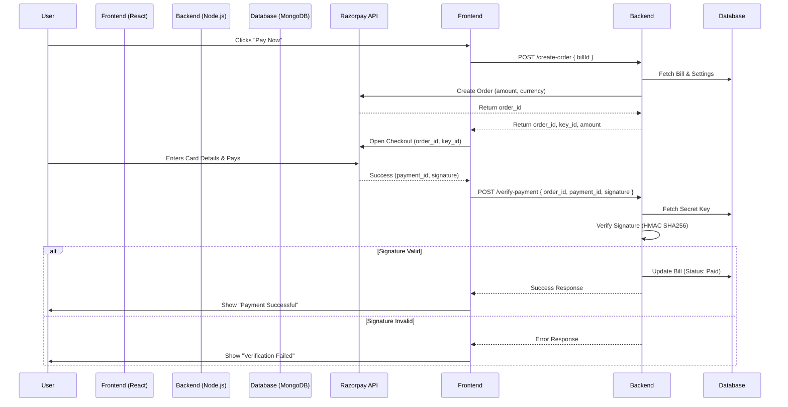

# Razorpay Integration Guide

This document provides a comprehensive overview of the Razorpay payment gateway integration in the Hospital Management System. It covers the theoretical flow, backend APIs, frontend implementation, and configuration steps.

## 1. Overview

The Razorpay integration allows the hospital to accept online payments for patient bills. It is designed with a **secure, server-side verification flow** to ensure that payments are legitimate before updating the database.

**Key Features:**

- Admin-configurable API keys (manage via dashboard).
- Secure server-side order creation.
- Cryptographic signature verification on the backend.
- Automatic bill status updates upon successful payment.

---

## 2. Theory of Operation

The integration follows the standard **Order-Based Payment Flow** recommended by Razorpay. This ensures that the amount paid by the user matches exactly what the server expects.

### The Flow:

1.  **Setup**: Admin saves Razorpay Key ID and Secret in the system settings.
2.  **Initiation**: When a user clicks "Pay Now", the frontend requests the backend to create an **Order**.
3.  **Order Creation (Backend)**: The backend calculates the amount from the database, calls Razorpay's API to create an order, and returns the `order_id` to the frontend.
4.  **Payment Collection (Frontend)**: The frontend opens the Razorpay Checkout form using the `order_id`. The user completes the payment.
5.  **Verification (Backend)**: Razorpay returns a `payment_id` and `signature` to the frontend. The frontend sends these details to the backend. The backend reconstructs the signature using its Secret Key and verifies it matches the one from Razorpay.
6.  **Finalization**: If the signature is valid, the backend marks the bill as "Paid".

---

## 3. Implementation Details

### 3.1 Backend (`/backend`)

The backend logic is primarily located in `routes/razorpayRoutes.js` and uses the `razorpay` npm package.

#### **Data Models**

- **`ProSetting`**: Stores `razorpayEnabled`, `razorpayKeyId`, and `razorpayKeySecret`.
- **`Billing`**: Stores `razorpayOrderId`, `razorpayPaymentId`, and updates `status` (paid/unpaid).

#### **API Endpoints**

| Method | Endpoint                       | Description                                                   | Access        |
| :----- | :----------------------------- | :------------------------------------------------------------ | :------------ |
| `GET`  | `/api/razorpay/settings`       | Returns public settings (`razorpayEnabled`, `razorpayKeyId`). | Authenticated |
| `GET`  | `/api/razorpay/settings/full`  | Returns keys including Secret.                                | Admin Only    |
| `POST` | `/api/razorpay/settings`       | Updates Razorpay keys and status.                             | Admin Only    |
| `POST` | `/api/razorpay/create-order`   | Creates a Razorpay Order for a bill.                          | Authenticated |
| `POST` | `/api/razorpay/verify-payment` | Verifies payment signature and updates bill.                  | Authenticated |

#### **Key Logic: Signature Verification**

The most critical part is in `/verify-payment`. It ensures security by performing:

```javascript
const body = razorpay_order_id + "|" + razorpay_payment_id;
const expectedSignature = crypto
  .createHmac("sha256", settings.razorpayKeySecret)
  .update(body.toString())
  .digest("hex");

const isAuthentic = expectedSignature === razorpay_signature;
```

---

### 3.2 Frontend (`/frontend`)

The frontend handles the user interaction and initiates the Razorpay checkout modal.

#### **Components**

1.  **`PaymentSettings.jsx`** (`admin-dashboard/settings`):

    - Allows Admins to input API keys.
    - Keys are stored in the database, not hardcoded in the frontend.

2.  **`PatientBills.jsx`** (`patient-dashboard`):
    - Loads the Razorpay script dynamically: `https://checkout.razorpay.com/v1/checkout.js`.
    - **Step 1:** Checks if online payment is enabled via API.
    - **Step 2:** Calls `/create-order` to get an Order ID.
    - **Step 3:** Initials `new window.Razorpay(options)` with the Order ID and Key ID.
    - **Step 4:** On success (`handler` callback), calls `/verify-payment`.

---

## 4. Sequence Diagram



---

## 5. Configuration Guide

To enable payments in the system:

1.  **Get Keys**:

    - Log in to [Razorpay Dashboard](https://dashboard.razorpay.com).
    - Go to **Settings** -> **API Keys**.
    - Generate a key pair.

2.  **Configure Admin Panel**:

    - Log in to the Hospital Management System as **Admin**.
    - Navigate to **Settings** -> **Payment Settings**.
    - Enable the "Razorpay Status" toggle.
    - Enter the **Key ID** and **Key Secret**.
    - Click **Save**.

3.  **Testing**:
    - Use Razorpay "Test Mode" keys first.
    - Log in as a Patient.
    - Go to "My Bills" and attempt to pay a pending bill.
    - Use Razorpay [Test Card Credentials](https://razorpay.com/docs/payments/payments/test-card-data/) to complete the transaction.

## 6. Troubleshooting

| Issue                              | Possible Cause                                           | Solution                                                                      |
| :--------------------------------- | :------------------------------------------------------- | :---------------------------------------------------------------------------- |
| **"Razorpay is not configured"**   | Admin settings are missing or disabled.                  | Go to Admin > Settings > Payment and enable it.                               |
| **"Minimum payment amount is ₹1"** | Bill amount is 0 or less than 1 INR.                     | Razorpay requires > 1 INR. Ensure bill has valid amount.                      |
| **"Payment verification failed"**  | Secret Key mismatch.                                     | Ensure the Secret Key in Admin Panel matches exactly with Razorpay Dashboard. |
| **Pending status after deduction** | Backend verification call failed (network/server error). | Check server logs. You may need to manually verify via Razorpay Dashboard.    |
